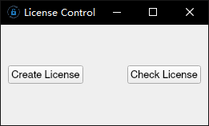
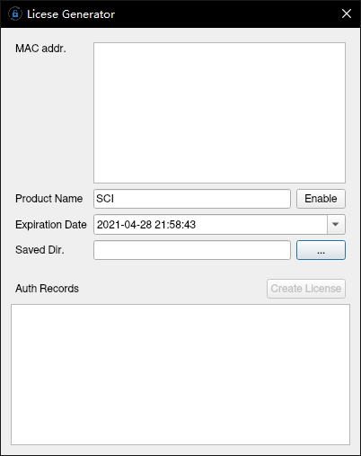
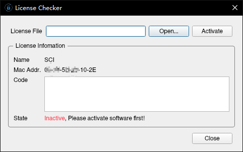
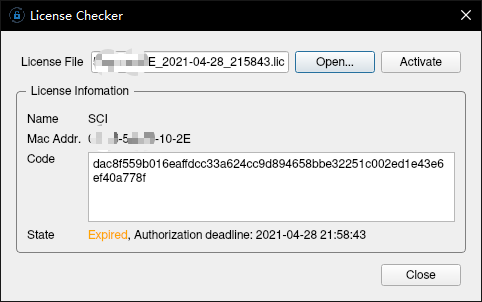

# License Control

A license control GUI tool with python.

## Usage

```bash
# first install all dependencies
poetry install

# then activate the virtual env
poetry shell

# finally run the GUI
python -m license_control
```

## Screenshots









## Refs

[Jarrettluo/ADAS_Evaluation_Launcher](https://github.com/Jarrettluo/ADAS_Evaluation_Launcher)
